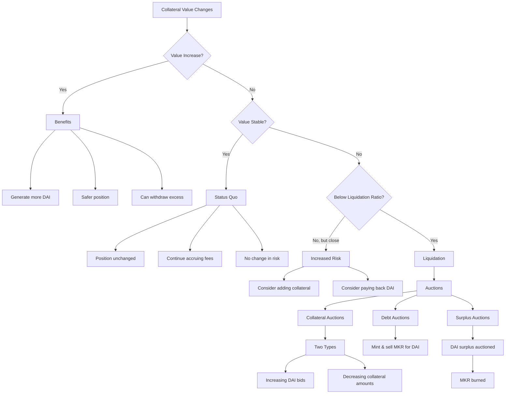

# MakerDAO and DAI: Understanding Collateral Dynamics

## Preface: What are MakerDAO and DAI?

MakerDAO is a decentralized autonomous organization (DAO) that operates on the Ethereum blockchain. It's one of the pioneering projects in decentralized finance (DeFi), aiming to create a stable cryptocurrency.

DAI is a decentralized, collateral-backed cryptocurrency soft-pegged to the US Dollar. Unlike centralized stablecoins, DAI is generated by users who lock up collateral assets in smart contracts called Vaults.

The Maker Protocol, which underlies DAI, allows users to generate DAI by depositing collateral assets. This system enables DAI to maintain its stability while remaining fully decentralized.

## Collateral Value Scenarios in the Maker Protocol

### I. When Your Collateral Increases in Value Over Time

- You don't receive interest directly, but you benefit from the increased value in several ways:
  - You can generate more DAI against your collateral without depositing additional assets.
  - Your position becomes safer, as you're further away from the liquidation ratio.
  - You can withdraw some of the excess collateral if you wish, while still maintaining a safe collateralization ratio.

**Note:** You're not earning interest on the collateral itself. The benefit comes from the increased borrowing power and reduced risk of liquidation.

### II. When the Collateral Remains Stable in Price

- Your position in the Vault remains unchanged.
- You continue to accrue the Stability Fee on the DAI you've generated.
- You don't gain additional borrowing power, but you also don't face increased liquidation risk.

### III. When it Loses Value But Not Significantly Below the Liquidation Ratio

- Your position becomes riskier as it moves closer to the liquidation ratio.
- You don't face immediate liquidation, but you're at higher risk if the price continues to fall.
- You might consider either:
  a) Adding more collateral to improve your position's safety.
  b) Paying back some of the generated DAI to reduce your debt and improve your collateralization ratio.

### IV. When it Loses Value Below the Liquidation Ratio

This scenario triggers the auction mechanisms:

#### Auctions

1. **Collateral Auctions**
   - These are triggered when a Vault (CDP) becomes undercollateralized.
   - The goal is to sell enough collateral to cover the Vault's outstanding debt plus a liquidation penalty.
   - It occurs in two phases:
     1. Increasing DAI bids for a fixed amount of collateral.
     2. Decreasing collateral amounts for a fixed DAI amount.

2. **Debt Auctions**
   - These occur if Collateral Auctions don't raise enough DAI to cover the system's debt.
   - New MKR tokens are minted and sold for DAI to cover the shortfall.

3. **Surplus Auctions**
   - When the system accumulates a surplus of DAI (from stability fees and liquidation penalties) beyond a certain threshold, this surplus is auctioned off.
   - Bidders compete by offering increasing amounts of MKR tokens, which are then burned, reducing the overall MKR supply.

## Important Notes

- You're always accruing the Stability Fee on the DAI you've generated, regardless of collateral price movements.
- The onus is on you to monitor your position and take action if needed to avoid liquidation.
- You retain full ownership of your collateral (minus the generated DAI and accrued fees) and can reclaim it at any time by paying back the DAI you've generated plus the accrued Stability Fee.
- The Maker Protocol doesn't offer interest on deposited collateral because it's not designed as a yield-generating platform for deposits. Instead, it's a system for generating DAI stablecoins against collateral.
- This system incentivizes users to actively manage their positions and to use generated DAI productively, while also maintaining the overall stability of the DAI stablecoin.

