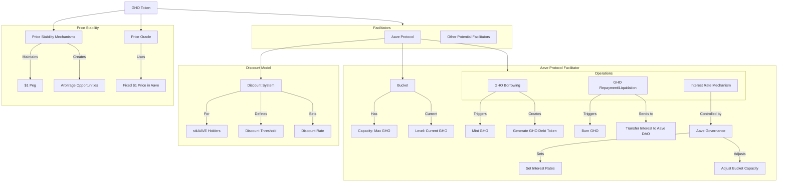

## 1. Fundamental Structure:

GHO is designed as an ERC20 token on the Ethereum Mainnet. It's a decentralized, overcollateralized stablecoin integrated into the Aave ecosystem.

## 2. Facilitator System:

- GHO uses a system of "Facilitators" to mint and burn tokens.
- Each Facilitator is assigned a "Bucket" with a specified capacity.
- The Capacity (C) is the maximum amount of GHO a Facilitator can generate.
- The current amount of GHO generated by a Facilitator is called its Level (L).

## 3. Available Supply Calculation:

The Available Supply (AS_GHO) at time t is calculated as:

AS_GHO_t = Σ(n=0 to N-1) max(0, CB(n)_t - LB(n)_t)

Where:
- N is the number of Facilitators
- CB(n)_t is the Capacity of Bucket n at time t
- LB(n)_t is the Level of Bucket n at time t

## 4. Aave Protocol as the First Facilitator:

- The Aave Protocol acts as the initial Facilitator for GHO.
- It integrates GHO similar to other assets, with specific GHO AToken and GHO Debt Token deployments.

## 5. Borrowing Mechanism:

- Users can borrow GHO against their collateral in the Aave Ethereum Pool.
- When borrowing, new GHO and GHO Debt Tokens are minted and transferred to the user.
- The Facilitator's Bucket level is updated to reflect the new amount minted.
- Borrowing fails if it would exceed the Facilitator's Bucket capacity.

## 6. Repayment and Liquidation:

- When repaying or liquidating GHO, tokens are returned to the pool and burned.
- Interest is transferred to the Aave DAO treasury.
- The original borrowed amount is burned.
- The Facilitator's Bucket level is decreased accordingly.

## 7. Interest Rate Mechanism:

- Unlike other assets in Aave, GHO interest rates are not determined algorithmically.
- Aave Governance sets interest rates statically.
- Each Facilitator deploys an independent "InterestRateStrategy" contract.
- This contract includes a method to update the GHO borrow rate, callable only by an entity approved by Aave Governance.

## 8. Discount Model:

- Implemented for Safety Module participants (stkAAVE holders).
- Defined by:
  a) Threshold T: Maximum GHO that can be borrowed at a discount per stkAAVE held.
  b) Total discount rate R_d: The discount on the borrow rate for discounted GHO.
- The final borrow rate is calculated based on these parameters and the user's stkAAVE balance.

## 9. Discount Accounting Implementation:

- Uses a global borrow index and user-based scaled balances for interest accumulation.
- Additional logic calculates and applies user discounts.
- Discounts are removed from the user's scaled balance to maintain accuracy with the global borrow index.

## 10. Price Stability Mechanisms:

- Users can always borrow, repay, and liquidate GHO at $1.
- This creates arbitrage opportunities to help maintain the peg.
- Aave governance can adjust borrow rates, discount threshold, and discount rate to influence GHO supply.

## 11. Price Oracle:

- The Aave Protocol is programmed to always use a price of 1 GHO = $1.
- This differs from market pricing via oracles used for other assets.

## 12. Governance Control:

- Aave Governance has significant control over GHO parameters.
- It can adjust interest rates, discount model parameters, and Facilitator Bucket capacities.

---

This architecture allows for a flexible, governance-controlled stablecoin that's deeply integrated with the Aave ecosystem while maintaining mechanisms for price stability and community benefits.
